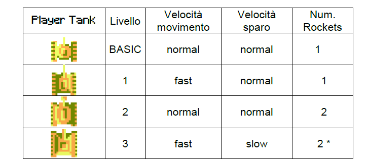

# Battle City  

## Introduzione:

Battle City è un videogioco arcade che rispecchia lo stile NES realizzato con una grafica 2D, utilizzando le swing fornite dalla libreria di Java 8.
Il player è rappresentato da un carrarmato che si scontrerà con altri carrarmati nemici con il solo scopo di difendere la sua fortezza.

## Modalita’ di gioco:

Il gioco prevede due modalità differenti:
• Nella carriera di gioco è possibile decidere se intraprendere la modalità single o multiplayer. L’obiettivo del giocatore è quello di difendere la propria “base”, rappresentata da una bandiera, dall’ assedio dei carrarmati nemici. La carriera è composta da un totale di 24 livelli, ognuno dei quali viene sbloccato solo in caso di vittoria nel livello precedente salvando i dati correnti del player. In ogni stage si ottiene un punteggio totale pari al numero e alla tipologia di nemici eliminati e ad ogni power up catturato, calcolandone un punteggio totale (hi-score) che in caso di superamento verrà aggiornato e visualizzato nel menu di gioco.
• Nella modalità online si è deciso volutamente di poter far connettere un massimo di due player, in modo tale da poter giocare in alleanza, contro i nemici.
Una volta selezionata la modalità network è possibile creare o accedere ad una stanza (lobby) di gioco, costituita da una chat per scambiare messaggi.
• Oltre alle modalità precedenti il gioco consente la creazione di mappe personalizzate attraverso l’utilizzo di un editor intelligente, che controlla se la mappa creata soddisfa o meno i requisiti di gioco.
Le difficoltà di gioco possono essere scelte tra easy, normal e hard, dove quest’ultimo è stato realizzato con l’intelligente algoritmo A-star, che non renderà così semplice la vostra esperienza di gioco.

## Specifiche dettagliate:

Ogni giocatore ha un numero di colpi (rockets) che variano in base al livello del carrarmato. Le vite del carrarmato sono 3, quando si muore, si ritorna automaticamente al livello 1 e si perde una vita ripartendo dalla posizione di partenza. Le vite perse possono essere recuperate attraverso dei potenziamenti. Quando si muore, si ritorna automaticamente al livello 1.



(*spara un colpo che distrugge le pareti in acciaio e sono due volte più efficaci)

Ogni nemico ha le proprie caratteristiche, i quali possono essere lampeggianti ( all’uccisione rilasciano cadere un powerUp random ) o normali che non rilasciano nessun powerUp. Inoltre anche i nemici posso catturare il potenziamento HELMET.


Ogni potenziamento può essere preso solo dai Player, escluso Helmet che invece può anche essere catturato dagli Enemy.


Ogni mappa può essere costituita dai seguenti oggetti


## Descrizione Classi:

### GameManager – (package core)

Questa classe  gestisce l’intero gioco per quanto riguarda la parte logica, sia nell’offline che in una partita online. Al suo interno troviamo metodi che hanno lo scopo di inizializzare il campo di battaglia e tutti i suoi relativi oggetti appartenenti reperendoli da una mappa scelta dall’utente. Inoltre svolge il ruolo di aggiornare gli update di tutti gli oggetti dinamici e gestirne le eventuali collisioni.

•Metodo principale: update()

Questo metodo è il nucleo del mondo in quanto si occupa di aggiornare tutte le componenti logiche di una partita, infatti si trova all’interno di ogni oggetto dinamico e gestisce tutte le collisioni relative ad essi. Per comodità, nel codice tale metodo è stato dichiarato abstract nella classe padre estesa ai vari figli rappresentati da oggetti dinamici, i quali si occuperanno di richiamare e ridefinire il seguente metodo. 

### GamePanel – (package gui)

Questa classe è strettamente dipendente dalla classe sopra enunciata (GameManager), ha il compito di gestire in modo sequenziale all’interno di un loop gli aggiornamenti logici seguiti da quelli grafici, stabilendo le diverse velocità degli oggetti in modo tale da avere la stessa esperienza di gioco su processori differenti. Successivamente prevede la cattura degli eventi per l’input da tastiera durante la partita, attraverso l’uso di una struttura dati molto versatile, in quanto consente di gestire più eventi in contemporanea ed ottenere una fluidità ottimale.

•Metodo principale: gameLoop()

Il seguente metodo viene ridefinito dalla classe Thread e richiama il gameLoop con la seguente sintassi :
```
gameLoop() {
          logic();
        graphic();
}
```

- **logic()** richiama a sua volta l’aggiornamento di tutte le istanze attraverso il metodo sopra enunciato nella classe GameManager.
- Il metodo **graphic()** si occupa di gestire le relative animazioni e i vari repaint degli oggetti. 

### Server– (package net)
In questa classe, viene creato il server socket per entrambi i servizi forniti per una specifica porta; I servizi forniti sono: la chat, dove il server rimane in ascolto per eventuali client che vogliono entrare e il game in cui il server, prima di avviare, aspetta che i due client si colleghino per avviare una sessione di gioco. Da notare che la classe Server implementa un Runnable il cui corpo del run() viene gestito da un thread specifico. 

### ServerGameManager - (package net)
In questa classe viene istanziato il GameManager del server. Inoltre viene gestito i nomi nel gioco per ogni giocatore connesso (P1 o P2), fondamentale per distinguere i client nel gioco. Il compito principale dell’intera classe è quello di avviare il thread che gira per la funzione gameLoop(), dopo aver fatto dei settaggi di sistema ai client connessi al server. 
Metodi principali:    startGame()     received(String buffer)
Quest’ultimo metodo permette alla classe di settare nella sua istanza di gameManager, tutti i dati che vengono inviati dai client, come per esempio, un tasto di movimento premuto, o il tasto pause e così via.

### ConnectionManager - (package net)
In questa classe, che implementa un Runnable, vengono settati i canali di comunicazione con gli altri client attraverso il BufferedReader e il PrintWriter. Nel run() ci sono due fasi:
1)Pre-Set, dove il client aspetta dal server che la partita abbia inizio attraverso la stringa “#START”, e mentre aspetta, gli arrivano stringhe con il nome dei player che si stanno collegando.
2)Post-set, dove, una volta ricevuto la stringa “#START”, il client legge continuamente stringhe che permettono di disegnare.

## Screenshots:


## Built With

* [Java](https://docs.oracle.com/javase/8/docs/api/) 

## Contributing

Giovanni Cosentino - https://github.com/giocos  
Davide Aloia - https://github.com/playa92
